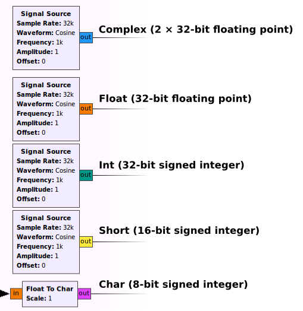
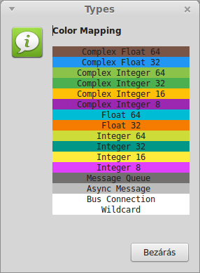
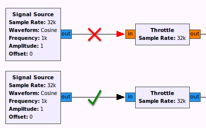
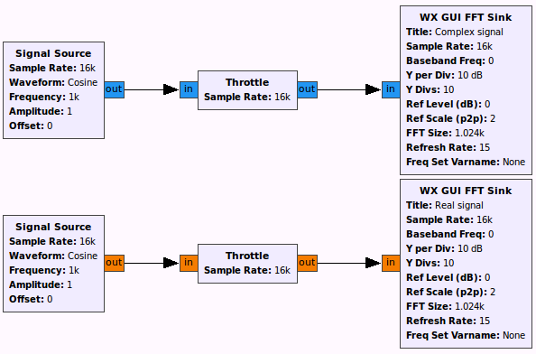
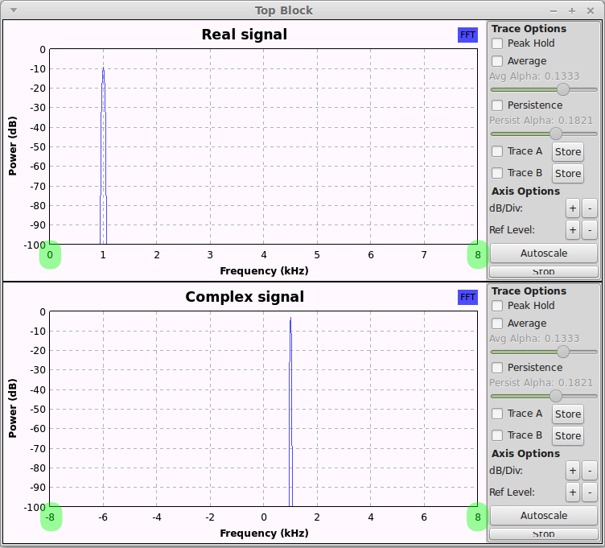

> You can find more about the data types available in GNU Radio in the [Doxygen documentation](http://gnuradio.org/doc/doxygen/gnuradio-runtime_2include_2gnuradio_2types_8h.html). 

In GNU Radio Companion, data types are distinguished with colors on the ports:

A full list of colors is available from the menu: **Help > Types**

You can only connect two ports with the same type:

In general, complex signals have double bandwidth compared to real signals (but also need twice as much bytes to store with the same precision):

