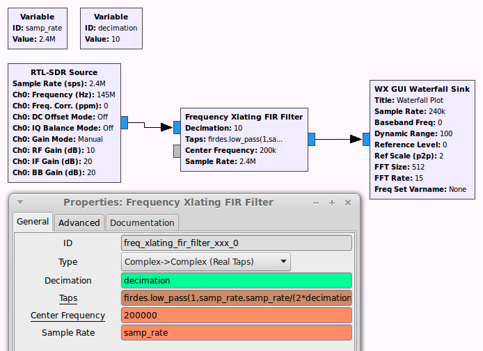

# Frequency Xlating FIR Filter

## GRC block

## Description

Frequency Xlating FIR Filter is a block that:

1. performs frequency translation on the signal,

2. downsamples the signal by running a [decimating](https://en.wikipedia.org/wiki/Decimation_(signal_processing)) [FIR filter](https://en.wikipedia.org/wiki/Finite_impulse_response) on it.

It can be used as a channelizer: it can select a narrow bandwidth channel from the wideband receiver input.

## Parameters

**Type:** It selects the [type](types.html) of the input and the output, and also the [filter taps](https://en.wikipedia.org/wiki/Finite_impulse_response).

If you have *Real taps*, then your FIR filter will be symmetric in the frequency domain. Some examples on filter characteristics:

If you have *Complex taps*, then your FIR filter will **not have to be** symmetric in the frequency domain. Some examples on filter characteristics:

<!-- TODO: speed of cplx and real -->

----

**Decimation:** the integer ratio between the input and the output signal's sampling rate. Example:

<pre>
Input sample rate = 240000
Decimation factor = 5
Output sample rate = 240000 ÷ 5 = 48000
</pre>

See also: [decimation](https://en.wikipedia.org/wiki/Decimation_(signal_processing)).

----

**Center frequency:** the frequency translation offset frequency. 

In practice, it is the frequency offset of the signal if interest to be selected from the input.

Example:

----

**Taps**: the vector of the complex or real taps of the [FIR filter](https://en.wikipedia.org/wiki/Finite_impulse_response).

If you generate the filter coefficients with a custom filter design tool, e.g. MATLAB:

<pre>[0.1, -0.2, 0.3, -0.2, 0.1]</pre>

If you do not want to filter anyway (but if you still decimate, the output will suffer from aliasing, see [decimation](https://en.wikipedia.org/wiki/Decimation_(signal_processing))):

<pre>[1]</pre>

You can also generate them by using `python` code.

Use this if you selected a type with **real taps**:

<pre>firdes.low_pass(1,samp_rate,samp_rate/(2*decimation), transition_bw)</pre>

Use this if you selected a type with **complex taps**:

<pre>firdes.complex_band_pass(1, samp_rate, -samp_rate/(2*decimation), samp_rate/(2*decimation), transition_bw)</pre>

**Note: transition_bw** is the transition bandwidth of the filter in Hz. The lower it is, the more taps the function will generate, and the more CPU time it will take to apply this filter. **This parameter will determine the CPU usage and thus the execution speed of the block.**

----

**Sample rate:** The sample rate of the input signal.

## Example flowgraph

## Notes

If you set `decimation` above 1, then the sampling rate of the block's output signal will differ from the input sampling rate.

You will have to set the sampling rate of all the blocks connected to its output correctly!

## Speed considerations

You might also consider using the *Frequency Xlating FFT Filter* instead of this block.

The speed of these two blocks compare differently in different applications, as it depends on the decimation factor and the length of the filter.

See [this article](http://www.trondeau.com/blog/2014/2/27/to-use-or-not-to-use-fft-filters.html) for more information.
